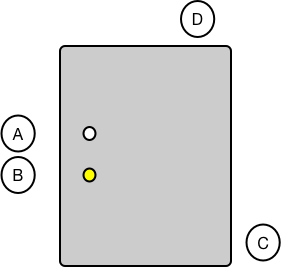

# Avimesa Gateway for Raspberry Pi User Guide

## Introduction

This project contains a user guide for the Avimesa Gateway for Raspberry Pi.

## Table of Contents
- [1. Overview](#1.-overview)
    - [1.1 Summary](#1.1-summary)
    - [1.2 Requirements](#1.2-requirements)
- [2. Quick Start](#2.-quick-start)
- [3. Power Supply](#3.-power-supply)
- [4. Gateway Modes](#4.-gw-modes)
    - [4.1 Unconfigured Network](#4.1-gw-modes-unconfigured)
    - [4.2 Gateway Setup](#4.2-gw-modes-gw-setup)
    - [4.3 Configured Network](#4.3-gw-modes-configured)
- [5. Gateway Setup](#5.-gw-setup)
    - [5.1 How to Enter Gateway Setup Mode](#5.1-gw-setup-how-to-enter)
    - [5.2 Using the Gateway Setup Application](#5.2-gw-setup-app)
    
    
    

[Top](#toc) 

## 1. Overview

The Avimesa Gateway for Raspberry Pi is used to facilitate network communications between Avimesa devices and the Avimesa Device Cloud.

In general, it simply provides:

1. Ability to configure the Gateway to connect to a Wi-Fi network
2. Once configured to a network, automatic Avimesa device discovery and connection mechanisms

After the intitial setup, no other actions should be required.

Figure 1 calls out the main components that are used in this guide:

&nbsp;&nbsp;&nbsp; A. Gateway Status LED 
&nbsp;&nbsp;&nbsp; B. Gateway Setup Button 
&nbsp;&nbsp;&nbsp; C. Power Connector 

 *Figure 1*

## 1.2 Requirements

1. A computer with Wi-Fi
2. The Avimesa Gateway for Raspberry Pi and power supply
3. A network with an internet connection

[Top](#toc) 

## 2. Quick Start (Wi-Fi)

For the first time setup, do the following:

1. Attach the power supply to the Gateway (Figure 1-C)
2. The Gateway will boot up and the `Gateway Status LED` (Figure 1-A) will flash green as it's in the `Unconfigured` state.
3. Press and hold the `Gateway Setup Button` (Figure 1-B) for 10 seconds until the `Gateway Status LED` (Figure 1-A) turns red.
4. Using a computer with Wi-Fi, connect to the "Avimesa-Gateway" Access Point, no password is required.
5. Enter the SSID and password for the network that you want the Gateway to connect to.
6. Press "Save" to reset the Gateway.  It will automatically connect to the configured network.

[Top](#toc) 

## 3. Power Supply
The Avimesa Gateway for Raspberry Pi kit comes with a power supply that is rated for use.

[Top](#toc) 

## 4. Gateway Modes

The Gateway can be in three modes that are directly related to it's Wi-Fi network status. 

## 4.1 Unconfigured

When in the `Unconfigured` mode, the Gateway is not setup to or has failed to connect to a configured Access Point.
The `Gateway Status LED` (Figure 1-A) will be **blinking green** in this state.

The Gateway Router Daemon will not run when in the state as it requires a network connection.  Thus, any Avimesa devices utilizing this gateway for network connectivity will fail to synchronize with the Avimesa Device Cloud.

## 4.2 Gateway Setup

When in the `Gateway Setup` mode, the Gateway is acting as an Access Point and, using a computer, you can connect to it and access the Gateway Setup application via a web browser.

This is much the same as when connecting to your home router's setup screen.

The `Gateway Status LED` (Figure 1-A) will be **solid red** when in this state.

The Gateway Router Daemon will not run when in the state as it requires a network connection.  Thus, any Avimesa devices utilizing this gateway for network connectivity will fail to synchronize with the Avimesa Device Cloud.

## 4.3 Configured

When in the `Cconfigured` mode, the Gateway is setup and has connected to a configured Access Point. 

The Gateway Router Daemon will be running when in the state, and will facilitate communications between Avimesa devices and the Avimesa Device Cloud.

The `Gateway Status LED` (Figure 1-A) will be **solid green** when in this state.

[Top](#toc) 

## 5. Gateway Setup (Wi-Fi)

## 5.1 How to Enter Gateway Setup Mode

To enter `Gateway Setup` mode, press and hold the `Gateay Setup Button` (Figure 1-B) for more than ten (10) seconds.  The `Gateway Status LED` (Figure 1-A) will turn **solid red** when it has changed modes.

When the Gateay is in `Gateway Setup` mode, you can connect to it from a computer using Wi-Fi.  Once connected, you can configure the Gateway to connect to your Wi-Fi.

## 5.2 Using the Gateway Setup Application

1. Using your computer's Wi-Fi setup, locate the "Avimesa-Gateway" Access Point and select it to connect to the Gateway.  No password is required.

 *Figure 2*

2. Using a web browser, enter `192.168.0.1` in the address bar and press `ENTER`
3. Select the SSID (network name) of the network you want the Gateway to connect to (if the network isn't present, press the "Scan" button)
4. Enter the network password
5. Click on the "Save" button

 *Figure 3*

The Gateway will reboot and attempt to connect to the network that was configured.

If the `Gateway Status LED` (Figure 1-A) turns to **solid green** after the reboot, the connection was successful.

If the `Gateway Status LED` (Figure 1-A) turns to **blinking green** after the reboot, the connection was unsuccessful and the process needs to be repeated starting at step 1.  Ensure the correct password was used. 

[Top](#toc) 